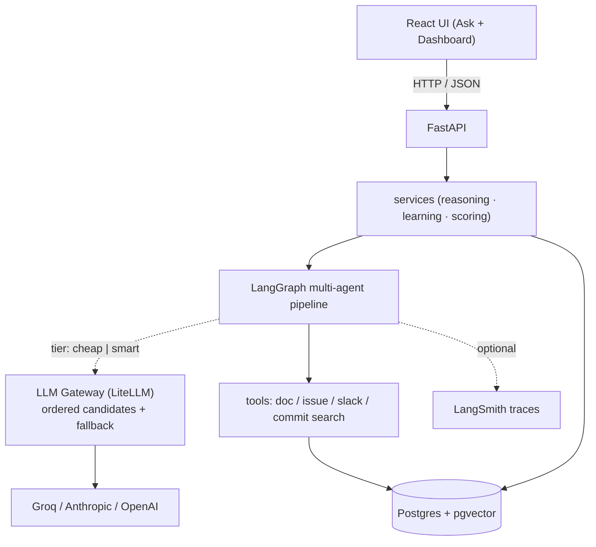
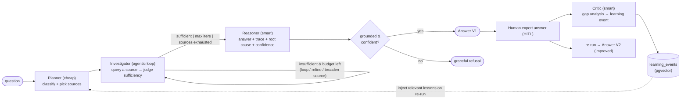

# ORE — Expert-Learning Organizational Reasoning Engine

A multi-agent AI that ingests organizational questions, **investigates knowledge sources like an
expert**, answers with evidence + a reasoning trace, **learns from a human expert's ground-truth
answer**, and re-runs to produce a **measurably better answer**.

> *An AI that learns how experts think — not one that just searches harder.*

Built with **FastAPI + LangGraph** (backend), **React + Vite + Tailwind** (frontend), and
**Postgres + pgvector** (storage). Multiple LLM providers sit behind a config-driven gateway with
cost tiers and automatic fallback.

---

## Table of contents
- [What it does](#what-it-does)
- [How it satisfies the multi-agent rubric](#how-it-satisfies-the-multi-agent-rubric)
- [Architecture](#architecture)
- [The agent flow (LangGraph)](#the-agent-flow-langgraph)
- [Quick start](#quick-start)
- [Configuring the LLMs](#configuring-the-llms)
- [Using it](#using-it)
- [Retrieval strategy](#retrieval-strategy)
- [The learning loop (V1 → V2)](#the-learning-loop-v1--v2)
- [Guardrails](#guardrails)
- [Evaluation & success metrics](#evaluation--success-metrics)
- [Observability](#observability)
- [The synthetic dataset](#the-synthetic-dataset)
- [Common commands](#common-commands)
- [Project layout](#project-layout)
- [Tech stack & design choices](#tech-stack--design-choices)

---

## What it does
A question is asked (Slack-style). The system independently investigates the available knowledge
(docs, issue tracker, chat, commits), drafts a **Version 1** answer with evidence, a reasoning trace,
a root cause, and a confidence score. A human expert then submits the real answer; the system runs a
**gap analysis**, captures what it missed as a **learning event**, and **re-runs** to produce a
**Version 2** that is measurably better — without any fine-tuning.

---

## How it satisfies the multi-agent rubric
| Requirement | Where in ORE |
|---|---|
| Multi-agent orchestration (≥3 specialized agents) | **Planner · Investigator · Reasoner · Critic** (4 agents) |
| LangGraph (or equivalent) | The graph wiring those nodes (`backend/app/agents/graph.py`) |
| Shared state across steps | One Pydantic graph state (`backend/app/agents/state.py`) |
| Tool use (≥2) | 4 tools: `doc_search`, `issue_search`, `slack_search`, `commit_search` |
| Structured outputs for handoffs | Pydantic schemas on every agent boundary (`backend/app/agents/schemas.py`) |
| Routing / branching | Planner picks sources; an agentic retrieval **loop**; answer-vs-refuse |
| RAG / knowledge grounding | pgvector semantic search over the doc corpus |
| Evaluation (≥5 scenarios) | 6 scenarios + metric harness (`backend/app/eval/`) |
| Debugging / observability | Structured JSON logs (per node + per LLM call) + optional LangSmith traces |
| Guardrails | Pydantic validation, evidence grounding, confidence threshold → graceful refusal |
| Human-in-the-loop | The expert answer is the ground truth that drives the learning loop |
| Demo-ready | `docker compose up` → end-to-end in the browser |

---

## Architecture


- **Backend layering:** `api/` (thin routers) → `services/` (orchestration + persistence) →
  `agents/` (the LangGraph) → `llm/` (provider-agnostic gateway) · `tools/` · `rag/` · `learning/` ·
  `db/` · `eval/` · `core/` (config, logging, guardrails, observability).
- **One datastore:** Postgres holds the knowledge corpus, the questions/answers/evidence, learning
  events, and eval runs; the **pgvector** extension powers both RAG and learning-memory retrieval.

---

## The agent flow (LangGraph)


| Agent | Tier | Responsibility |
|---|---|---|
| **Planner** | cheap | classify the question, choose which sources to investigate (routing) |
| **Investigator** | cheap (judge) | query tools, judge sufficiency, loop / broaden — dynamic `k`, max-iter cap |
| **Reasoner** | smart | synthesize evidence → answer, reasoning trace, root cause, confidence |
| **Critic** | smart | diff V1 vs the expert answer → a structured learning event |

---

## Quick start
**Prerequisites:** Docker + Docker Compose. A free **Groq** API key (https://console.groq.com/keys).

```bash
cp .env.example .env          # then set GROQ_API_KEY=...
docker compose up --build
```
On startup the backend applies DB migrations and seeds the synthetic corpus automatically.

| Service | URL | Notes |
|---|---|---|
| Frontend | http://localhost:5173 | Ask workspace + Dashboard |
| Backend API | http://localhost:8000 | OpenAPI/Swagger at `/docs`, health at `/health` |
| Postgres | localhost:5432 | user / pass / db = `ore` / `ore` / `ore` |

---

## Configuring the LLMs
Agent code **never names a provider** — each node asks the gateway for a **tier** (`cheap` or
`smart`). Tiers are defined in **`config/llm.yaml`** as an *ordered list of candidates*: index 0 is
the primary, the rest are automatic fallbacks tried in order when a candidate errors or is
rate-limited. This gives **cost control** (cheap models for routing/classification, smart models for
reasoning) and **resilience** (transparent failover) — all as config, no code changes.

**1) Provider API keys** live in `.env` (read by the gateway from the environment):
```dotenv
GROQ_API_KEY=...          # default provider (free)
ANTHROPIC_API_KEY=        # optional — for the smart tier
OPENAI_API_KEY=           # optional — for the smart tier
```

**2) Tiers** in `config/llm.yaml` (default — Groq only, zero cost):
```yaml
tiers:
  smart:
    - { provider: groq, model: llama-3.3-70b-versatile, temperature: 0.2, max_tokens: 1024 }
  cheap:
    - { provider: groq, model: llama-3.1-8b-instant,   temperature: 0.0, max_tokens: 512 }
```

**3) Upgrade the smart tier to a frontier model** — add one candidate (it becomes primary; Groq
stays as the automatic fallback) and set its key in `.env`. No code changes:
```yaml
tiers:
  smart:
    - { provider: anthropic, model: claude-sonnet-4-6, temperature: 0.2 }   # primary (needs ANTHROPIC_API_KEY)
    - { provider: groq,      model: llama-3.3-70b-versatile }               # fallback
```
Verify a tier end-to-end (calls both tiers live):
```bash
docker compose exec backend python -m app.llm.smoke
```

**Other tunables** (in `.env`, with sane defaults): `EMBEDDING_MODEL`, `EMBEDDING_DIM`, `RAG_TOP_K`,
`USE_LLM_JUDGE` (root-cause scoring via an LLM judge vs embeddings).

---

## Using it
**Frontend (recommended)** — http://localhost:5173:
1. Pick a question from the dropdown (or type your own) → review **V1** (left column).
2. Provide the **expert answer** (a "Load reference answer" button autofills it for seeded questions),
   optionally listing the **sources** you used (enables live evidence-coverage scoring).
3. See the **Gap analysis** (what V1 missed) → click **Re-run → V2** and compare side-by-side, with a
   confidence delta, new-evidence markers, and metric chips.
4. Open **Dashboard** for accuracy/learning trends across evaluation runs.

**API** — the same loop via `curl`:
```bash
# 1. Ask → V1 (note question_id)
curl -s -X POST localhost:8000/questions -H 'Content-Type: application/json' \
  -d '{"text":"What caused the checkout latency spike in INC-87?"}'

# 2. Expert answer (+ optional sources) → returns the learning event (gap analysis)
curl -s -X POST localhost:8000/questions/<ID>/human-answer -H 'Content-Type: application/json' \
  -d '{"answer_text":"The data-pipeline backfill saturated the shared billing DB pool.","root_cause":"shared pool exhaustion","expected_sources":["NIM-420","b2c3d4e","t-inc-1"]}'

# 3. Re-run with injected memory → improved V2
curl -s -X POST localhost:8000/questions/<ID>/rerun

# Full loop view (V1, expert answer, lesson, V2, live metrics)
curl -s localhost:8000/questions/<ID>
```
Key endpoints: `POST /questions`, `GET /questions`, `GET /questions/{id}`,
`POST /questions/{id}/human-answer`, `POST /questions/{id}/rerun`, `GET /scenarios`,
`GET /metrics/eval-runs`.

---

## Retrieval strategy
Each source uses the matching strategy that fits it, and all tools return a **uniform `Evidence`**
object (`source_type, source_ref, title, snippet, score`):

| Tool | Source | Strategy |
|---|---|---|
| `doc_search` | wiki / postmortems / design docs | **Semantic** — embed query, pgvector **cosine** top-k |
| `issue_search` | issue tracker | **Structured + keyword** — status/owner/service filters + `ILIKE` |
| `slack_search` | chat threads | **Keyword** — `ILIKE` + term-overlap score |
| `commit_search` | commit history | **Keyword + service filter** |

The **Investigator** orchestrates these as an **agentic loop** (not a fixed top-k): it picks a
source, runs the tool, filters for relevance (docs must clear a cosine floor), accumulates evidence,
and a cheap-tier **sufficiency judge** decides whether to stop, refine the query, or move on. If the
planned sources are exhausted but evidence is still thin, it **broadens to unsearched sources** — so
a weak routing decision still recovers. The loop is bounded by a max-iterations cap.

---

## The learning loop (V1 → V2)
No fine-tuning — learning is **retrieved-memory injection**:
1. The **Critic** compares V1 against the expert answer and emits a structured **learning event**
   (missed sources, missed reasoning, corrected root cause, one-line lesson).
2. The event is embedded and stored in pgvector.
3. On re-run (and on future similar questions), the top relevant lessons are **retrieved and injected**
   into the Planner + Reasoner prompts, steering both source selection and reasoning.

This produces a transparent, measurable V1→V2 improvement that you can trace back to a specific lesson.

---

## Guardrails
- **Structured-output validation** on every agent handoff (Pydantic).
- **Evidence grounding** — answers must cite source ids; the system surfaces what it relied on.
- **Confidence threshold** — below it, the system returns a graceful *"insufficient evidence"*
  instead of hallucinating.
- **Human-in-the-loop** — the expert answer is the load-bearing source of truth (not a bolt-on
  approval gate).

---

## Evaluation & success metrics
The harness (`backend/app/eval/`) runs the seeded scenarios through the real V1→expert→V2 path,
scores them, stores each run, and feeds the Dashboard trends.

| Metric | How it's computed | Target |
|---|---|---|
| Answer similarity to expert | embedding cosine(ai_answer, expert_answer) | ≥ 0.75 |
| Root-cause identification | **LLM judge** (semantic 0–1), embedding fallback | ≥ 0.70 |
| Evidence coverage | expert's sources covered by the answer's evidence | ≥ 0.80 |
| Learning improvement | **gap-closed**: `(v2−v1)/(1−v1)` of a composite, V1→V2 | ≥ 20% |
| Response time | end-to-end generation wall-clock | < 15 s |
| Test-scenario coverage | scenarios run / total | 100% |

```bash
docker compose exec backend python -m app.eval.run_eval --limit 1 --fresh   # quick check
docker compose exec backend python -m app.eval.run_eval --fresh --delay 8   # full run (paced for Groq free tier)
```
The scores are embedding/judge-based proxies; the harness records each run so improvement is read as
the share of the *remaining gap* closed (honest against an already-strong V1 baseline).

---

## Observability
- **Structured JSON logs** are always on: every agent node logs its decision, and every LLM call logs
  the model used, latency, tokens, cost, and whether a fallback fired — all correlated by
  `question_id`.
- **LangSmith** (optional): set `LANGSMITH_TRACING=true` + `LANGSMITH_API_KEY` in `.env` and the full
  graph + LLM calls appear as traces in LangSmith.

---

## The synthetic dataset
The corpus models a fictional SaaS company, **"Nimbus"** — five services with owners, a delayed
release (`v2.4`), a production incident (`INC-87`), a blocked initiative (Reporting v2), plus
interconnected issues, Slack threads, commits, and docs. It's small but cross-linked, so realistic
questions require **joining facts across sources** (e.g. *"Why was v2.4 delayed?"* spans an issue, a
Slack thread, and a revert commit). No real or sensitive data is used. Re-seed after edits:
```bash
docker compose exec backend python -m app.db.seed --force
```

---

## Common commands
```bash
# Lint, format check, type check (backend)
docker compose exec backend sh -c "ruff check app && ruff format --check app && mypy app"

# Backend tests
docker compose exec backend pytest -q

# Live LLM gateway smoke test (both tiers; needs GROQ_API_KEY)
docker compose exec backend python -m app.llm.smoke

# Re-seed the synthetic corpus
docker compose exec backend python -m app.db.seed --force

# Apply DB migrations manually (also runs on startup)
docker compose exec backend python -m app.db.migrate

# Frontend checks
docker compose exec frontend sh -c "npx tsc --noEmit && npx prettier --check src"
```

---

## Project layout
```
backend/
  app/
    api/        thin FastAPI routers (questions, metrics, scenarios, health)
    agents/     LangGraph: graph, shared state, handoff schemas, nodes (planner/investigator/reasoner)
    llm/        provider-agnostic gateway (tiers + fallback), structured output, metrics
    tools/      doc / issue / slack / commit search → uniform Evidence
    rag/        embeddings + chunking/ingest (pgvector)
    learning/   Critic, learning-event store, retrieved-memory injection
    services/   reasoning (V1/V2), learning (HITL), scoring, question detail
    db/         SQLAlchemy models, async session, Alembic migrations
    eval/       scenarios, metrics, LLM judge, runner + CLI
    core/       config, logging, guardrails, observability
    data/       synthetic "Nimbus" corpus + qa_scenarios.json
frontend/       React + Vite + TypeScript + Tailwind (Ask workspace + Dashboard)
config/         llm.yaml — provider/model tiers
docker-compose.yaml
```

---

## Tech stack & design choices
- **FastAPI + LangGraph** — async API; explicit graph/state/edges map cleanly to the agent topology
  and the conditional routing the problem needs.
- **LLM gateway over LiteLLM** — one interface across Groq/Anthropic/OpenAI, with tiers + fallback +
  per-call cost/latency capture; providers are swapped in `config/llm.yaml`, never in code.
- **Postgres + pgvector** — one container for relational data *and* vector search (RAG + learning
  memory), with transactional consistency.
- **Retrieved-memory learning** — a real, explainable V1→V2 lift without fine-tuning.
- **Python 3.12, `uv`, Ruff, mypy** (strict, fully typed); **React 18 + TypeScript (strict) + Tailwind**.
- Everything is **dockerized**: `docker compose up` brings up backend, frontend, and Postgres.
